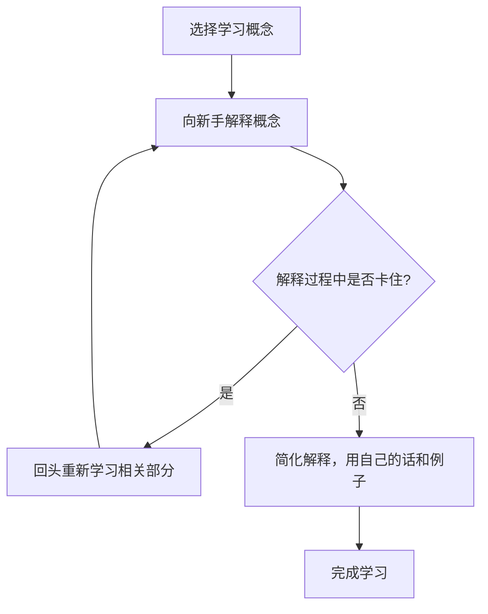
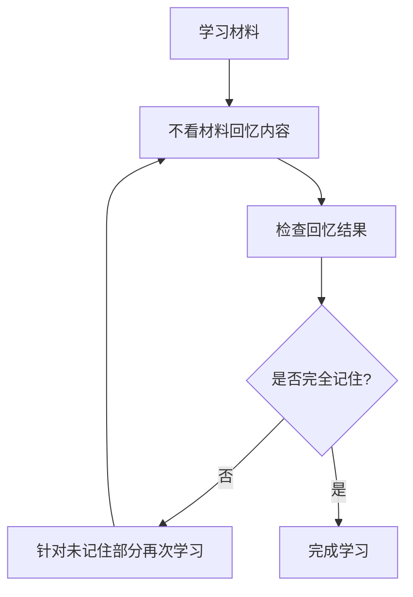
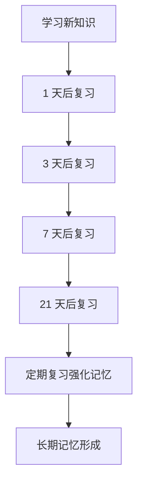

# 作图工具-学习法

## Tool
### mermaid
https://mermaid.live
#### 费曼学习法

#### 主动回忆法

#### 间隔重复法

## 思维导图
### xmind

## UML

### plantUML
- [Official website](https://plantuml.com/zh/)
- [demo](https://zhuanlan.zhihu.com/p/427358291)

### IDEA plant plugins
- idea plugin

## 流程图
### Omni全家桶
- OmniGraffle Mac平台的流程图绘制软件，相当于windows平台的visio
- OmniPlan 工期规划甘特图的工具

### Gliffy diagrams
